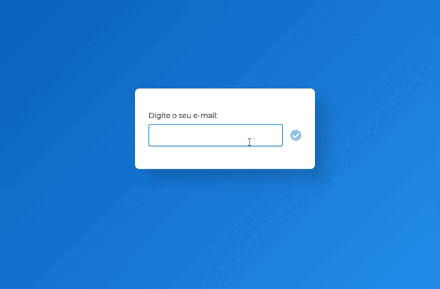

<h1 align="center"> :desktop_computer: Demonstração </h1>

***
### :mag: Sobre  
Projeto para checar e validar um endereço de e-mail utilizando JavaScript.
***
### :hammer_and_wrench: Ferramentas Utilizadas  
- 
- 
- 
